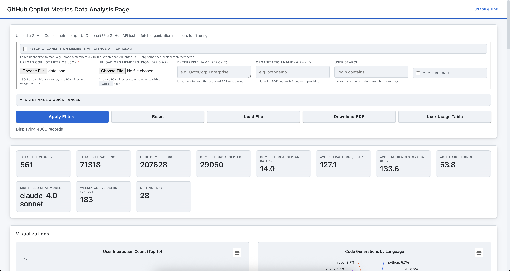
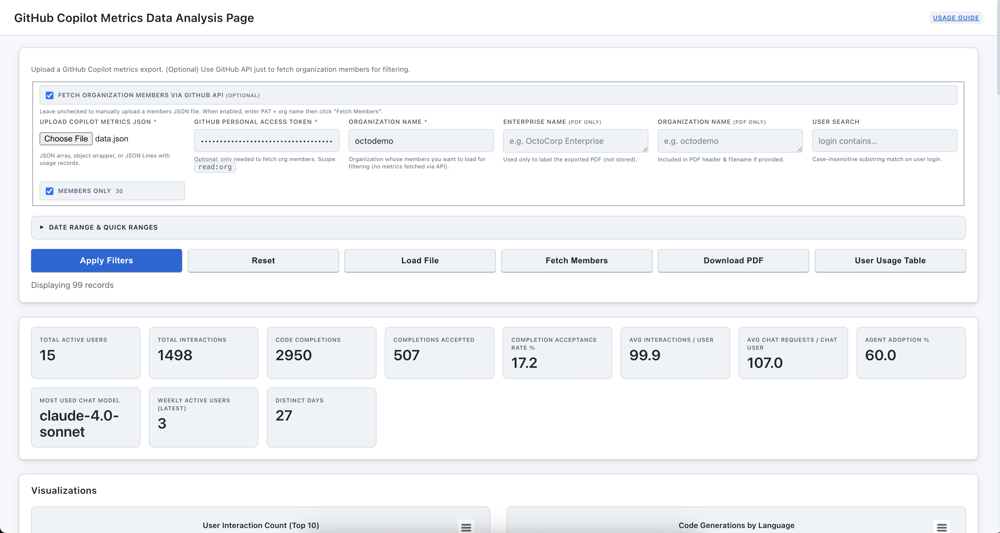

## GitHub Copilot Metrics Analyzer – Usage Guide

This is a local, client‑side dashboard for exploring GitHub Copilot Enterprise usage exports. It supports both **local file uploads** and **direct GitHub API integration**. No data is uploaded to a server: everything stays in your browser.

See `metrics-updates.md` for details on the new Lines of Code (LoC) metrics and agent mode handling introduced in the private preview.

### Quick Start Options

#### Option 1: Upload + (Optional) API Members Fetch (Recommended Hybrid)
1. Export a Copilot metrics JSON/JSONL file (enterprise or org export)
2. (Optional) Create a PAT with `read:org` scope if you want automatic member list
3. Upload the metrics file
4. (Optional) Enable the "Fetch organization members via GitHub API" checkbox
5. Enter PAT + Organization name then click "Fetch Members" (only members are fetched; metrics stay local)

#### Option 2: File Upload
1. Export your Copilot metrics from GitHub
2. Open the dashboard and select "Upload File" mode  
3. Upload your JSON/JSONL export file
4. Optionally upload organization members file

---

### Detailed Instructions

#### Using GitHub API Integration

Hybrid mode: The dashboard no longer downloads metrics via API. You always provide the metrics export file. The GitHub API (if used) is only for retrieving the organization member list to enable the “Members only” filter.

**Step 1 (Optional): Create GitHub Personal Access Token**
Scope: `read:org` (only needed if you want to auto‑fetch members; otherwise skip.)

**Step 2: Access the Dashboard**
Open `index.html` locally or visit: https://ramesh2051.github.io/copilot-user-metrics/

**Step 3: Upload Metrics File**
Upload your Copilot metrics export JSON/JSONL.

**Step 4 (Optional): Fetch Members**
Check the API members toggle, enter PAT + Organization name, click "Fetch Members". Members load; enable the “Members only” filter.

**What happens under the hood (members fetch)**
1. Calls `GET /orgs/{org}/members` to build a Set of logins
2. Updates UI with member count
3. If “Members only” is checked, filters currently loaded metrics immediately

**Telemetry requirement (general)**: Users must have IDE telemetry enabled for their activity to appear in exported metrics.

#### Using File Uploads (Traditional Method)

### 1. Prepare your data
Export your Copilot metrics (enterprise or organization scope) from GitHub.
This can be exported by clicking on download button here. https://github.com/enterprises/{enterprise_slug}/insights/copilot

Optional (file mode only): export a list of organization members (array or JSON Lines) containing a `login` field to enable the “Members only” filter.

### 2. Open the dashboard
Just open `index.html` in a modern desktop browser (Chrome, Edge, Firefox, Safari). You can double‑click the file or serve the folder with a simple local web server.\
Or you can navigate to this URL. \
https://ramesh2051.github.io/copilot-user-metrics/

### 3. Choose your data source
The dashboard now supports two data sources:

**GitHub API (Hybrid Members Fetch Only):**
- Does NOT download metrics
- Optional convenience to load org members list
- Requires only `read:org` scope

**File Upload (Traditional):**
- Use exported JSON/JSONL files
- Works offline
- Manual members file upload if needed
- Full control over data scope

### 4. Load data
1. Click “Upload Copilot Metrics JSON” and choose your export file.
2. The status message will show progress; once parsed, summary metric cards and charts render automatically.
3. (Optional) Upload the members file to activate the “Members only” checkbox.

Screenshots:

---

---

---

### 4. Use filters & quick ranges
* User Search: type part of a login (case‑insensitive) to narrow results.
* Date Range: set explicit From / To days, or use quick buttons (7d / 14d / 28d / All) for instant ranges.
* Members only: after loading a members file, restrict metrics to those users.
* Apply Filters: re‑computes the summary cards and all charts with current criteria.
* Reset: clears search, date edits, quick‑range selection, and members‑only filter, restoring the full dataset.

### 5. Explore the metrics
Summary cards show totals (active users, interactions, completions, acceptances, acceptance rate, distinct days, weekly active users, chat adoption metrics, and most used chat model). Below them, interactive charts visualize:
* Top users by interaction, completions vs acceptances, acceptance rate %
* Language usage (totals, per day stacked area)
* Model usage (overall, per day, per feature)
* Feature usage, IDE distribution
* Lines of Code (LoC): Suggested (chat) vs Edits (added/deleted) by feature, and Edits by language
* LoC Suggested (Delete) by feature
* LoC: Agent vs Non‑Agent (Edits)
* Heatmaps (Language × Model, Feature × Model)
* Daily and weekly active users

#### NEW: Per-User Usage Table & CSV Export
Click the "User Usage Table" button (enabled after loading data) to view a sortable table of aggregated metrics per user:
* Interactions, completions, acceptances, acceptance %
* Distinct active days
* LoC Suggested (add), LoC Added, LoC Deleted
* Top model, language, and feature (based on interaction counts)

You can:
* Click column headers to sort ascending/descending.
* Export the current (filtered) per-user aggregations to CSV via the "Export CSV" button inside the table view.
* Use existing filters (date range, user search, members only) then open or refresh the table; it always reflects current filters.
* Click "Back to Dashboard" to return to the charts.

Hover any chart element for tooltips. Categories auto‑trim if extremely long to preserve readability.

### 6. Generate a PDF report
1. (Optional) Enter Enterprise Name and/or Organization Name (for labeling only; not used for API fetch now).
2. Click “Download PDF” after data loads. A multi‑page PDF (summary grid + each chart) is generated entirely in your browser.
3. (Optional) If you need raw per-user detail, use the CSV export from the User Usage Table (not included in the PDF) for further spreadsheet analysis.

### 7. Privacy & local‑only behavior
* Files are read with the File API; contents are not sent elsewhere.
* PDF rendering rasterizes charts locally using Highcharts + html2canvas + jsPDF.
* Reloading the page clears all loaded data.

### 8. Troubleshooting
| Symptom | What to try |
|---------|-------------|
| “Upload parse error” | Ensure valid JSON / JSON Lines; remove comment lines; check for trailing commas. |
| No charts after upload | File may be empty or fields missing required numeric metrics. Verify export source. |
| LoC values are null | Before 2025-09-01 exports may include legacy fields where new LoC metrics are null. Update IDEs and use newer dates for full LoC coverage. |
| Members only disabled | Upload a members file with objects containing a login field. |
| Date inputs empty or disabled | Ensure records contain a `day` field (YYYY-MM-DD). |
| PDF button disabled | Load a metrics file first; button enables after successful parsing. |

### 9. Suggested workflow
1. Download latest enterprise metrics export from GitHub.
2. (Optional) Download members list from GitHub Organisation Members page.
3. Open dashboard locally and load metrics file.
4. Apply date + user filters to focus on adoption windows (e.g., last 28 days).
5. Review acceptance, agent adoption %, weekly active users.
6. Review LoC metrics: Suggested (from chat panel code blocks) vs Added/Deleted (from agent_edit and edit mode), Suggested (Delete) by feature, and an Agent vs Non‑Agent view of edits. Note that agent edits are excluded from suggestions by design.
6. Export PDF for sharing with stakeholders.

### 10. FAQ
* Does it send data over the network? \
No—network requests are only for public script libraries (Highcharts / jsPDF / html2canvas); your data file never leaves the page.
* Can I bookmark a filtered view? \
State isn’t persisted; reapply filters after reopening.
* Large files? \
Modern browsers handle several MB. Extremely large exports may slow rendering—filter by date to reduce scope.

### LoC Metrics Notes
- Availability: New LoC fields (`loc_suggested_to_add_sum`, `loc_suggested_to_delete_sum`, `loc_added_sum`, `loc_deleted_sum`) are fully populated on and after 2025‑09‑01. Earlier reports may show these as null while legacy `generated_loc_sum`/`accepted_loc_sum` remain 0.
- Agent behavior: Agent and edit mode edits are counted as added/deleted lines under the `agent_edit` feature. Suggestions for agent mode only cover chat panel code blocks; inline edits by the agent are not counted as suggestions.

---
For feature ideas or adjustments, edit `script.js` or `style.css` — no build step required.

## GitHub API (Members Only) Integration

### Required Token Scope
`read:org` – to list organization members.

### Endpoint Used
`GET /orgs/{org}/members`

### Troubleshooting
| Symptom | Cause | Resolution |
|---------|-------|------------|
| 401 Unauthorized | Missing/invalid PAT | Recreate PAT with `read:org` |
| 403 Forbidden | Insufficient rights to view members | Use a user with org membership / admin rights |
| 404 Not Found | Wrong org name or private org w/o access | Verify org name and membership |
| Members only disabled | No members loaded yet | Fetch members or upload members file |

### Security Notes
* PAT never stored; used only for the single members request.
* Metrics JSON stays fully local (uploaded file only).
* No external metrics endpoints are called.

